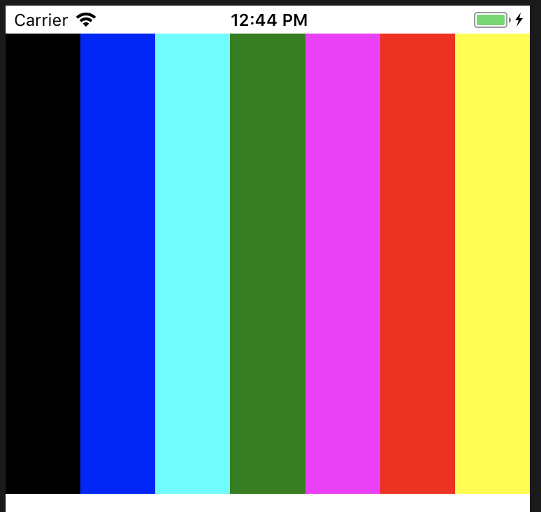
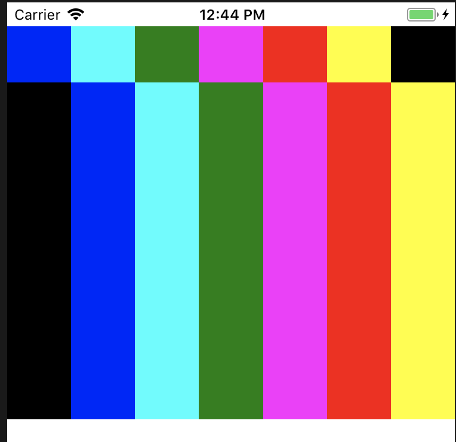
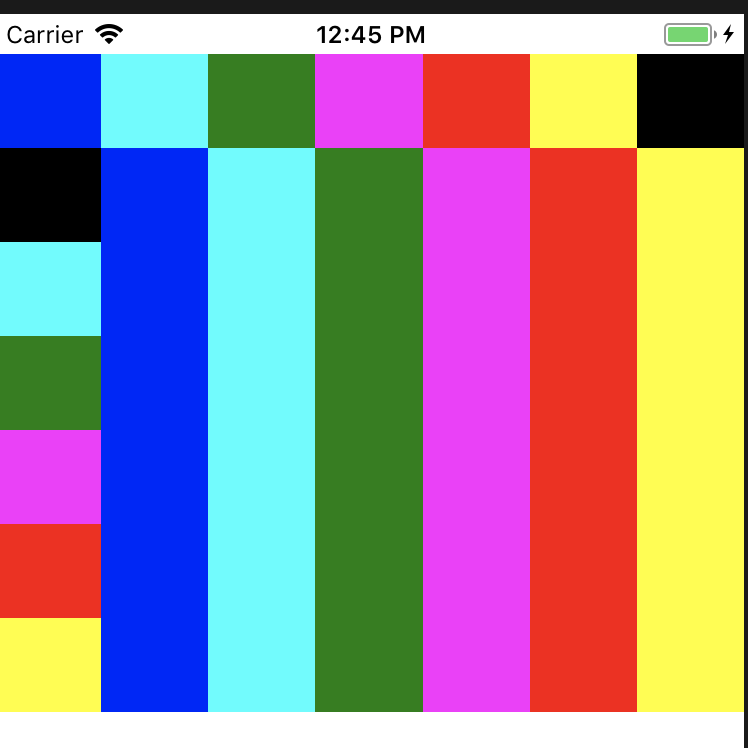

# Reactnative_iOS
develop a simple ios frontend with react native

# If you are new fish, read this to install environment
(1). Install latest Xcode  
(2). Install HomeBlew   
ruby -e "$(curl -fsSL https://raw.githubusercontent.com/Homebrew/install/master/install)"  
(3). Install Node.js   
下载地址：https://nodejs.org/download/  
Make sure that /usr/local/bin is in your $PATH.  
(4). (Optional)Install WatchMan  
```
brew install watchman  
```
(5). Install Flow:     
```  
brew install flow  
```
(6). Install React Native CLI:       
```
npm install -g react-native-cli
```  
(7). Create project  
react-native init XXXXXX
(8). Run with iOS virtual machine   
react-native run-ios

(9). Dependency
npm install react-native-flexbox-grid

(10). Extra
Run on Android device.  
Step 1: Install Android SDK
```
brew cask install android-sdk
```

Step 2: Install required SDK  
```
sdkmanager "platforms;android-23" "build-tools;23.0.1" "add-ons;addon-google_apis-google-23"
```

Step 3: Test installation
```
react-native run-android
```

Cause I didnt have Android device, so I havent test it in Android, I am pretty sure it will work. And I will update if having chance.  

# Design Idea:
1.  Use flexbox to create square grid  

  How to wrap flexbox into different lines?  

  Here is the solution:   
  use flexbox-grid model to create row and column flexbox   
  use Text to extend the line's width.(the way that i think, cause there is no variable for width)  
2.  Add button into the grid to control the color
3.  Use this.state to change render color with one click


# Result



